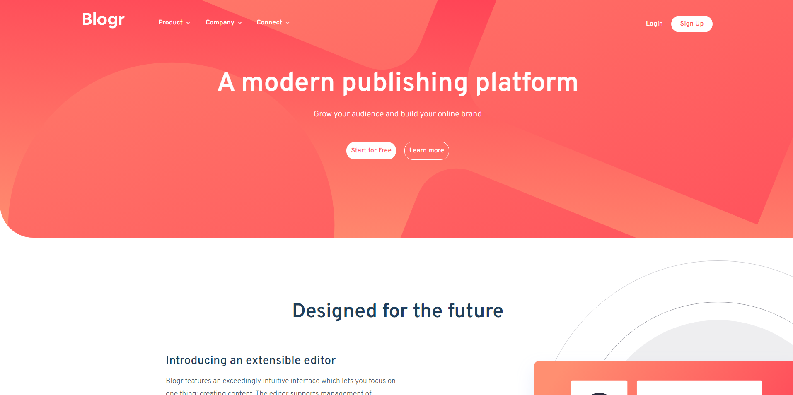

# Frontend Mentor - Blogr landing page solution

This is a solution to the [Blogr landing page challenge on Frontend Mentor](https://www.frontendmentor.io/challenges/blogr-landing-page-EX2RLAApP). Frontend Mentor challenges help you improve your coding skills by building realistic projects. 

### Screenshot

### Links
- [Live site](https://0xzaid-blogr.netlify.app/)

### Built with
- [React](https://reactjs.org/) - JS library
- Vite
- CSS modules
- Flexbox